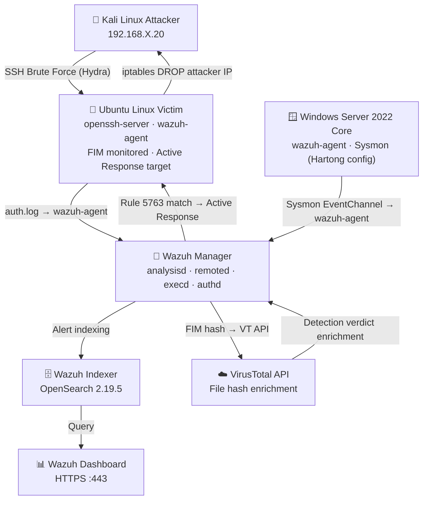

# 🛡️ Defender-Wazuh — Active XDR & Incident Response Lab

> **Domain:** Security Operations (SOC) · SIEM/XDR · Threat Detection · Active Defense  
> **Stack:** Wazuh 4.14.5 · OpenSearch 2.19.5 · Sysmon (Olaf Hartong config) · VirusTotal API · Kali Linux · Ubuntu Server · Windows Server 2022 Core

---

## What This Project Demonstrates

Most Wazuh walkthroughs stop at passive log aggregation — deploy an agent, watch events appear, call it a SIEM. This lab goes further: it builds a **closed-loop, automated defence pipeline** where a detected attack directly triggers a real firewall block on the victim host — no human in the loop, no manual intervention.

The core question this lab answers:

> *"If an attacker is actively brute-forcing one of my endpoints right now, how quickly can the platform detect, classify, and neutralise that threat — automatically?"*

Answer demonstrated here: **under 3 minutes, triggered by a single rule match, enforced at the OS firewall layer with zero manual steps.**

---

## Architecture



**All four VMs run on a VMware host-only network segment — fully isolated, no internet dependency for the attack/defence loop itself.**

---

## Lab Environment

| Component | Spec |
|---|---|
| Wazuh Manager/Indexer/Dashboard | Official OVA — 4 vCPU, 8 GB RAM, 50 GB disk |
| Linux Victim | Ubuntu Server 22.04 (OSBoxes) — 2 GB RAM |
| Windows Victim | Windows Server 2022 Standard Core (Eval) — 2 GB RAM |
| Kali Attacker | Kali Linux 2024.x — 2 GB RAM |
| Network | VMware VMnet1 host-only — `192.168.X.0/24` |
| Hypervisor | VMware Workstation (host-only adapters, VMware Tools installed) |

---

## Project Structure

```
defender-wazuh/
├── README.md                    ← you are here
├── troubleshooting.md           ← full troubleshooting reference
├── config/
│   ├── ossec-manager.conf       ← manager ossec.conf (FIM + VT + Active Response blocks)
│   ├── ossec-linux-agent.conf   ← linux victim agent config
│   └── sysmonconfig.xml         ← Olaf Hartong modular Sysmon config (reference copy)
├── rules/
│   └── (any custom local rules added, if applicable)
└── screenshots/
    ├── 01-ova-import/
    ├── 02-network-adapter/
    ├── 03-dns-hardening/
    ├── 04-password-tool/
    ├── 05-dashboard-login/
    ├── 06-agent-wizard/
    ├── 07-agents-active/
    ├── 08-sysmon-install/
    ├── 09-sysmon-ossecconf/
    ├── 10-sysmon-telemetry/
    ├── 11-fim-config/
    ├── 12-vt-integration/
    ├── 13-eicar-drop/
    ├── 14-fim-alert/
    ├── 15-vt-enrichment/
    ├── 16-active-response-config/  ← planned
    ├── 17-hydra-attack/            ← planned
    ├── 18-rule-5763-alert/         ← planned
    ├── 19-mitre-tag/               ← planned
    ├── 20-iptables-drop/           ← planned
    ├── 21-active-response-log/     ← planned
    └── 22-hydra-blocked/           ← planned
```

---

## Implementation Walkthrough

### Phase 1 — Server Deployment

The Wazuh all-in-one OVA bundles three components that would normally run on separate nodes in production:

- **Wazuh Indexer** — an OpenSearch fork; the database that stores, indexes, and makes every alert searchable
- **Wazuh Manager** — the brain; receives raw agent logs, runs decoders to extract structured fields, evaluates rules, and triggers active responses
- **Wazuh Dashboard** — the web UI; queries the indexer and renders alerts, agent status, MITRE mappings, and compliance dashboards

Two hardening steps applied **before the first service start** that meaningfully affected stability:

**1. DNS/hostname resolution hardening.** OpenSearch's bootstrap performs several internal hostname lookups. On an isolated host-only network with no real DNS server, each lookup can hang for ~10 seconds before timing out — and with multiple lookups stacked during startup, this is enough to blow past systemd's default service start timeout entirely, producing misleading "timed out" failures with no visible error. Fixed by:

```bash
echo "127.0.0.1 $(hostname)" | sudo tee -a /etc/hosts
sudo sed -i 's/^#\?MulticastDNS=.*/MulticastDNS=no/' /etc/systemd/resolved.conf
sudo sed -i 's/^#\?LLMNR=.*/LLMNR=no/' /etc/systemd/resolved.conf
sudo systemctl restart systemd-resolved
```

**2. Systemd start timeout extension.** The indexer's JVM bootstrap on this VM required substantially more than systemd's 90-second default:

```bash
sudo mkdir -p /etc/systemd/system/wazuh-indexer.service.d
sudo tee /etc/systemd/system/wazuh-indexer.service.d/override.conf > /dev/null << 'EOF'
[Service]
TimeoutStartSec=600
EOF
sudo systemctl daemon-reload
```

**📸** `screenshots/01-ova-import/` — VMware OVA import settings  
**📸** `screenshots/02-network-adapter/` — Host-only adapter configuration  
**📸** `screenshots/03-dns-hardening/` — `/etc/hosts` entry and `getent` fast-resolution confirmation  
**📸** `screenshots/04-password-tool/` — Password tool completing cleanly (key redacted)  
**📸** `screenshots/05-dashboard-login/` — Wazuh dashboard overview, all API checks green

---

### Phase 2 — Agent Onboarding & Sysmon Telemetry

Two endpoints enrolled: a **Linux victim** (primary target — SSH brute-force + FIM + Active Response) and a **Windows Server 2022 Core victim** (Sysmon telemetry enrichment).

#### Linux Agent

Installed via the dashboard's Deploy New Agent wizard, registered against the manager's host-only IP. Agent enrollment uses `wazuh-authd`'s auto-registration — the agent requests a key, the manager issues and stores it, and the connection is established on port 1514.

#### Windows Agent + Sysmon

Sysmon installed on Windows Server Core (no GUI — all via PowerShell) using Olaf Hartong's pre-merged `sysmonconfig.xml`. The key configuration step that Wazuh documentation underemphasises: **the agent must be explicitly told to read the Sysmon event log channel**, otherwise the agent runs fine while silently collecting zero Sysmon data:

```xml
<localfile>
  <location>Microsoft-Windows-Sysmon/Operational</location>
  <log_format>eventchannel</log_format>
</localfile>
```

> **Why Sysmon over native Windows logs?** Native Windows Security events tell you *that* a process started. Sysmon tells you the full command line, parent process chain, file hash, and network connections — the telemetry depth SOC analysts actually pivot on during live investigations. The difference between "notepad.exe ran" and "powershell.exe spawned from outlook.exe with a base64-encoded command line" is the difference between a noise event and a real detection.

**Telemetry verification** — rather than relying on the dashboard's Discover view (which had a rendering issue with its time-field configuration on this Wazuh version), data integrity was verified directly against the indexer's REST API via the built-in Dev Tools console:

```json
GET wazuh-alerts-*/_search
{
  "size": 3,
  "query": { "match_all": {} }
}
```

Response confirmed **1,523 real alert documents** in the index, including Sysmon Event ID 1 (Process Create) entries with MITRE ATT&CK technique tags automatically applied by the Hartong configuration at collection time — before the data even reaches Wazuh's rule engine:

```json
{
  "agent": { "name": "WIN-S61JPNQ4T0Q" },
  "data": {
    "win": {
      "system": { "eventID": "1", "channel": "Microsoft-Windows-Sysmon/Operational" },
      "eventdata": {
        "ruleName": "technique_id=T1059.001,technique_name=PowerShell",
        "commandLine": "powershell.exe -EncodedCommand ...",
        "image": "C:\\Windows\\System32\\WindowsPowerShell\\v1.0\\powershell.exe"
      }
    }
  }
}
```

An unexpected bonus: Wazuh's Security Configuration Assessment (SCA) module ran automatically against the Linux agent on enrollment, executing the **CIS Ubuntu Linux 22.04 LTS Benchmark** and mapping each finding to MITRE tactics, PCI-DSS, SOC 2, ISO 27001, and NIST 800-53 simultaneously — a free compliance-posture baseline generated without any additional configuration.

**📸** `screenshots/06-agent-wizard/` — Deploy new agent wizard with generated install command  
**📸** `screenshots/07-agents-active/` — Agents list showing both Linux and Windows endpoints "Active"  
**📸** `screenshots/08-sysmon-install/` — Sysmon install confirmation in PowerShell  
**📸** `screenshots/09-sysmon-ossecconf/` — `ossec.conf` Sysmon eventchannel block  
**📸** `screenshots/10-sysmon-telemetry/` — Dev Tools console showing live Sysmon alert documents with MITRE tags

---

### Phase 3 — File Integrity Monitoring & VirusTotal Enrichment

FIM configured on the Linux victim with real-time inotify monitoring of a sensitive directory:

```xml
<!-- In /var/ossec/etc/ossec.conf on the Linux agent -->
<syscheck>
  <directories realtime="yes">/root</directories>
</syscheck>
```

VirusTotal integration configured on the **manager** (not the agent — a common placement mistake) to automatically query VT with the SHA256 hash of any file flagged by FIM:

```xml
<!-- In /var/ossec/etc/ossec.conf on the manager -->
<integration>
  <name>virustotal</name>
  <api_key><!-- REDACTED --></api_key>
  <group>syscheck</group>
  <alert_format>json</alert_format>
</integration>
```

The integration chain works as follows: a file change in the monitored directory triggers a FIM (syscheck) alert → the manager's `wazuh-integratord` daemon picks up any alert from the `syscheck` group → queries VirusTotal with the file's hash → a second, enriched alert is generated containing VT's detection ratio and the names of any AV engines that flagged the file.

Tested using the EICAR test string — a harmless, internationally standardised test file that every AV engine flags as malicious by convention, producing a VirusTotal positive result without requiring actual malware in the lab environment.

**📸** `screenshots/11-fim-config/` — `<directories realtime="yes">` config line  
**📸** `screenshots/12-vt-integration/` — `<integration>` block (API key redacted)  
**📸** `screenshots/13-eicar-drop/` — Terminal `ls -la` showing EICAR file drop with timestamp  
**📸** `screenshots/14-fim-alert/` — Dashboard alert for FIM "Added file" event  
**📸** `screenshots/15-vt-enrichment/` — VirusTotal-enriched alert showing detection verdict

---

### Phase 4 — Active Defense: Automated Attacker Lockout *(Planned)*

> **Status:** Configuration complete. Live execution pending resolution of a VMware hypervisor-level disk I/O bottleneck (see Troubleshooting section below) that prevents the Wazuh manager from reliably starting in the current lab environment. The Active Response configuration has been written and validated syntactically — the lab simply cannot be run end-to-end until the underlying infrastructure issue is resolved.
>
> This section documents the intended execution and expected outcomes in full, as the implementation design is complete.

#### What This Phase Achieves

When a brute-force attack is detected against the Linux victim, Wazuh automatically instructs the victim's own OS firewall to drop all further traffic from the attacker's IP — with **no human intervention required** and a response latency measured in seconds, not minutes.

#### Active Response Configuration

```xml
<!-- /var/ossec/etc/ossec.conf on the manager -->
<active-response>
  <disabled>no</disabled>
  <command>firewall-drop</command>
  <location>local</location>
  <rules_id>5763</rules_id>
  <timeout>180</timeout>
</active-response>
```

**How it works under the hood:** `firewall-drop` is a pre-built script shipped with every Wazuh agent. When `wazuh-analysisd` on the manager matches rule 5763 (SSH brute-force — fires after multiple failed login attempts from the same source IP within a defined time window), it signals `wazuh-execd` running on the Linux victim to execute the `firewall-drop` script with the attacker's IP as an argument. The script adds an `iptables DROP` rule for that IP. The `<timeout>180</timeout>` parameter auto-removes the block after 3 minutes, enabling clean re-testing without manual iptables cleanup.

**`<location>local</location>`** is the key attribute — it means the response executes on the *agent that generated the alert* (the Linux victim), not on the manager itself.

#### Planned Execution Steps

1. Boot Kali attacker VM on the same host-only subnet
2. Verify reachability: `ping <linux-victim-ip>`
3. Run SSH brute-force with Hydra:
   ```bash
   hydra -l admin -P passwords.txt ssh://<linux-victim-ip> -t 4
   ```
4. Observe rule 5763 firing in the dashboard's Threat Hunting view, tagged with **MITRE ATT&CK T1110 — Brute Force**
5. Confirm `iptables DROP` rule applied on the victim: `sudo iptables -L -n`
6. Confirm active response log: `sudo tail -f /var/ossec/logs/active-responses.log`
7. Re-run Hydra — connections stall/timeout, demonstrating the block is live
8. Wait 180 seconds — block auto-clears, demonstrating the timeout mechanism

#### Expected Evidence (Screenshots Pending)

**📸** `screenshots/16-active-response-config/` — Active Response XML block in `ossec.conf`  
**📸** `screenshots/17-hydra-attack/` — Hydra terminal output mid-attack (before block)  
**📸** `screenshots/18-rule-5763-alert/` — Rule 5763 alert in dashboard  
**📸** `screenshots/19-mitre-tag/` — MITRE ATT&CK T1110 tag on alert detail pane  
**📸** `screenshots/20-iptables-drop/` — `iptables -L -n` showing DROP rule for attacker IP  
**📸** `screenshots/21-active-response-log/` — `active-responses.log` excerpt showing `firewall-drop` invocation  
**📸** `screenshots/22-hydra-blocked/` — Hydra output after block, showing connection timeouts

---

## Key Findings & Technical Observations

| Finding | Impact |
|---|---|
| OpenSearch startup blocks on DNS lookups in isolated environments | Resolves with `/etc/hosts` entry + mDNS/LLMNR disabled in `systemd-resolved` |
| Wazuh password tool requires a live indexer on port 9200 to run its backup step | Documented ordering requirement: indexer must be `active (running)` before running the tool |
| IDE virtual disk controller causes severe I/O bottleneck under OpenSearch's write load | Performance issue; SCSI/SATA controller strongly recommended for any Wazuh lab on VMware |
| Wazuh's `<integration>` block belongs on the **manager**, not the agent | Common misplacement documented; placing it on the agent silently fails |
| Sysmon's `<localfile>` eventchannel block is not auto-configured on Windows agent install | Must be manually added to `ossec.conf` or Sysmon events are never forwarded |
| Dashboard's Discover view had a time-field misconfiguration on this Wazuh version | Worked around via direct indexer API query (Dev Tools console) — data pipeline verified healthy |

---

## Troubleshooting Quick Reference

| Symptom | Likely Cause | Fix |
|---|---|---|
| Indexer times out on startup | DNS lookup hanging during bootstrap | `/etc/hosts` entry + disable mDNS/LLMNR |
| Indexer times out on startup | systemd's default 90s too short | `TimeoutStartSec=600` override |
| Indexer times out repeatedly | IDE disk controller I/O bottleneck | Change VM hard disk to SCSI controller |
| Password tool: "backup could not be created" | Indexer not running yet | Start indexer first, then run the tool |
| Password tool: "backup could not be created" | `/etc/wazuh-indexer/backup` wrong ownership | `sudo rm -rf /etc/wazuh-indexer/backup` and retry |
| Agent shows "Duplicate agent name" after manager rebuild | Old registration still in manager database | Remove stale agent from dashboard, then `rm /var/ossec/etc/client.keys` on agent and restart |
| Agent shows "Never connected" despite running | Wrong manager IP in `ossec.conf` | Edit `<address>` tag directly in `ossec.conf` and restart agent |
| VMware networking drops after host sleep/resume | VMware NAT Service stopped | Restart `VMware NAT Service` from elevated host PowerShell |
| VM agents show "Disconnected" after host wake | VMs lost DHCP lease | `sudo dhclient -r && sudo dhclient` (Linux), `ipconfig /release && /renew` (Windows) |
| Wazuh dashboard login: both old and new password rejected | Password tool interrupted mid-write | Restore from `~/internal_users-known-good.yml.bkp` backup, restart indexer |

For the complete, step-by-step troubleshooting reference including exact commands and expected outputs for every failure mode encountered during this build:

👉 **[Full Troubleshooting Guide](./troubleshooting.md)**

---

## Skills Demonstrated

- **SIEM/XDR deployment** — standing up a production-grade Wazuh stack from a pre-built OVA, hardening it against known failure modes
- **Linux sysadmin** — systemd unit overrides, `/etc/hosts` and `systemd-resolved` tuning, iptables, SSH configuration, service dependency management
- **Endpoint telemetry** — Sysmon deployment with a community-maintained detection configuration, eventchannel forwarding, MITRE ATT&CK tagging at the collection layer
- **API integration** — VirusTotal enrichment pipeline wired into FIM alerts, verified via direct OpenSearch REST API queries
- **Active defense configuration** — Wazuh Active Response pipeline design, `firewall-drop` integration, rule-to-response mapping
- **Real incident investigation** — multi-day, hands-on troubleshooting of a complex, multi-component Java/Linux stack; root-cause analysis from kernel logs, Java thread dumps, systemd journal, and OpenSearch cluster logs; identifying and working around a hypervisor-level I/O bottleneck

---

## References

- [Wazuh Official Documentation](https://documentation.wazuh.com)
- [Olaf Hartong — sysmon-modular](https://github.com/olafhartong/sysmon-modular)
- [VirusTotal API Documentation](https://docs.virustotal.com)
- [MITRE ATT&CK — T1110 Brute Force](https://attack.mitre.org/techniques/T1110/)
- [MITRE ATT&CK — T1059.001 PowerShell](https://attack.mitre.org/techniques/T1059/001/)
- Reference walkthrough: [Building a Complete SOC Lab from Scratch — Salma Doumi, Medium](https://medium.com/@SALMA_DOUMI/building-a-complete-soc-lab-from-scratch-a8ac9989b7b4)

---

*Built as part of a home lab portfolio series. Other projects: [Multi-Tenant Linux Isolation & Bash Automation](link) · [Multi-VLAN Dual-Stack ROAS Topology (Packet Tracer)](link)*
